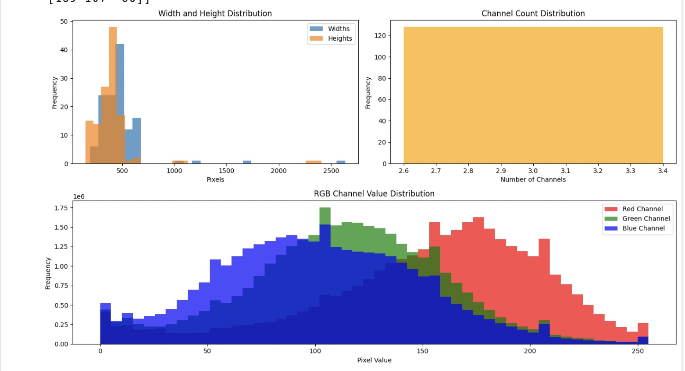

# vitaminE-Equitable-AI-for-Dermatology
## Team Members
- [Emily-Ann Willix](https://github.com/emilyannwx)
- [Kymari Bratton](https://github.com/Kymari28)
- [Gianna Lamarre](https://github.com/gialam25)
- [Fernanda Del Toro](https://github.com/Fernandadeltoro)
- [Maria Santos](https://github.com/dsanmar)

## Project Highlights

- Developed a deep learning model using EfficientNetB0 with transfer learning to classify 21 skin conditions.
- Achieved a public leaderboard F1 score of **0.47666** on Kaggle.
- Addressed AI fairness in dermatology through targeted data augmentation and class rebalancing.
- Incorporated exploratory data analysis and image preprocessing to understand dataset diversity and quality.
- Evaluated model performance and highlighted limitations in accuracy across skin tones.

[Link to Kaggle Competition Page](https://www.kaggle.com/competitions/bttai-ajl-2025/overview)

## Setup & Execution

To run the notebook and reproduce our results:

1. Clone the repository:
    ```bash
    git clone https://github.com/emilyannwx/vitaminE-Equitable-AI-for-Dermatology.git
    cd vitaminE-Equitable-AI-for-Dermatology
    ```

2. (Optional) Set up a virtual environment:
    ```bash
    python -m venv env
    source env/bin/activate  # For Windows: .\env\Scripts\activate
    ```

3. Download the dataset from Kaggle and place it in the `data/` folder as per the competition rules.

4. Launch Jupyter Notebook and open:
    ```
    maria-s-notebook.ipynb
    ```

## Project Overview
This project is part of the Break Through Tech AI Fellowship in collaboration with the Algorithmic Justice League (AJL). Our goal was to build an inclusive machine learning model that can accurately classify 21 different skin conditions across diverse skin tones. The competition emphasizes not only performance but also fairness and inclusivity in healthcare AI.

## Real-World Significance
AI in healthcare often underperforms for people with darker skin due to biased training data. Our model aims to improve diagnostic accuracy and promote fair healthcare for all.

## Dataset & Approach

- **Dataset**: A subset of FitzPatrick17k, containing 4,500 images covering 21 skin conditions across different skin tones.
- **Preproccessing**: Cleaned data, applied augmentation, and analyzed class distribution.

## EDA Visualizations


## Model Development

- **Architecture**: EfficientNetB0 with custom top layers for classification.
- **Training Strategy**:
  - Image resizing to 224x224.
  - Data split: 80% training, 20% validation.
  - Categorical crossentropy loss and Adam optimizer.
- **Augmentation**:
  - Rotation
  - Width/Height shifts
  - Zoom
  - Horizontal flipping
- **Callbacks**:
  - EarlyStopping 
- **Evaluation Metric**: Weighted F1 score due to class imbalance.

## Results & Key Findings

- **Final Public Leaderboard Score**: 0.47666 (Weighted F1)
- The model performed reasonably well on common conditions but showed reduced accuracy on rare classes and images with darker skin tones.
- Augmentation helped improve generalization, but dataset imbalance remained a challenge.

## Impact Narrative

In developing this model, our team sought to address the underrepresentation of darker skin tones in dermatology datasets. We focused on:

- Using data augmentation to simulate a more balanced training set.
- Analyzing model behavior across varying tones to detect performance gaps.
- Advocating for inclusivity in dataset curation and AI evaluation practices.

We believe that even incremental improvements in fairness can lead to more equitable healthcare outcomes for communities historically excluded from medical innovation. Our work supports the Algorithmic Justice League's mission by demonstrating how student-led projects can meaningfully contribute to ethical AI development.

## Next Steps & Future Improvements

- Incorporate fairness-aware loss functions (e.g., focal loss or reweighting).
- Expand training data with additional dermatology datasets featuring darker skin tones.
- Implement Grad-CAM and LIME to visualize and audit model reasoning.
- Engage with medical professionals to refine label accuracy and real-world applicability.
- Explore federated learning to train models on distributed, privacy-preserving patient data.

## References & Additional Resources

- Groh, M. et al. (2021). *Evaluating Deep Neural Networks Trained on Clinical Images in Dermatology*.
- Fitzpatrick17k Dataset: [GitHub Repo](https://github.com/emilyannwx/vitaminE-Equitable-AI-for-Dermatology.git)
- Grad-CAM Paper: https://arxiv.org/abs/1610.02391
- AJL Fairness Guide: [Algorithmic Justice League Resource](https://drive.google.com/file/d/1kYKaVNR_l7Abx2kebs3AdDi6TlPviC3q/view)
